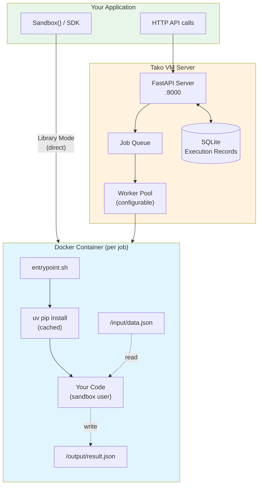

# Tako VM

Job queue infrastructure for Python AI agents. Self-hosted. Free.

Stop rebuilding Redis + Bull + Postgres for async job processing.
Tako VM handles job queues, retries, and execution history out of the box.

```python
uv pip install tako-vm

from tako_vm import Sandbox

with Sandbox() as sb:
    result = sb.run("print(1 + 1)")
    print(result.stdout)  # "2"
```

## Why Tako VM?

Sandbox solutions like [e2b](https://e2b.dev) and [microsandbox](https://github.com/microsandbox/microsandbox) give you isolated code execution—but that's it. You still need to build:

| You build | With sandbox-only | With Tako VM |
|-----------|-------------------|--------------|
| Job queue | Redis + Celery/Bull | ✅ Built-in |
| Execution history | Postgres + schema | ✅ SQLite included |
| Retry logic | Custom code | ✅ Automatic |
| Idempotency | Deduplication logic | ✅ `idempotency_key` |
| Replay/debugging | Custom tooling | ✅ Rerun/fork API |

**Tako VM is the complete package:**

- **Job queue + workers** - Async execution with worker pool, no Redis/Celery setup
- **Execution history** - Every job persisted with stdout, stderr, timing, artifacts
- **Replay to debug** - Rerun past jobs with exact same code and inputs
- **Docker isolation** - Each job in its own container with seccomp filtering
- **Network isolation** - No network by default, optional allowlist per job type
- **Self-hosted** - Your machine, offline-capable, zero per-execution cost

## Architecture

Tako VM executes Python code in isolated Docker containers with:
- **Security** - Network isolation, read-only filesystem, seccomp filtering, resource limits
- **Configurability** - Pydantic-validated YAML config with env var overrides
- **Job Types** - Pre-configured environments with network control per job type
- **Fast Dependencies** - Runtime package installation via [uv](https://github.com/astral-sh/uv) (~10x faster than pip)
- **Execution History** - Full job records with timing, artifacts, and error details



**Security layers applied to every container:**
- `--network=none` (isolated by default)
- `--read-only` filesystem
- `--cap-drop=ALL`
- `--security-opt=no-new-privileges`
- Seccomp syscall filtering
- Non-root execution (uid 1000)

## Installation

### Prerequisites

- Docker 20.10+
- Python 3.9+
- [uv](https://github.com/astral-sh/uv)

### Install

```zsh
uv venv && source .venv/bin/activate
uv pip install -e ".[server]"
docker build -t code-executor:latest -f docker/Dockerfile.executor .
```

## Quick Start (Library Mode)

```python
from tako_vm import Sandbox

# Basic execution
with Sandbox() as sb:
    result = sb.run("print('Hello from sandbox!')")
    print(result.stdout)

# With dependencies (installed via uv, cached for speed)
with Sandbox() as sb:
    result = sb.run("""
import pandas as pd
print(pd.__version__)
""", requirements=["pandas"])

# With local packages
sb = Sandbox(package_dirs=["./my_utils"])
result = sb.run("from my_utils import helper; helper.process()")

# With input/output data
with Sandbox() as sb:
    result = sb.run("""
import json
with open("/input/data.json") as f:
    data = json.load(f)
result = {"sum": data["x"] + data["y"]}
with open("/output/result.json", "w") as f:
    json.dump(result, f)
""", input_data={"x": 10, "y": 20})
    print(result.output)  # {"sum": 30}
```

Your code runs in a container with these paths:
- `/input/data.json` - Your `input_data` as JSON (read-only)
- `/output/result.json` - Write output here, returned as `result.output`
- `/tmp/` - Temporary files (read-write)

The first run builds the executor Docker image automatically (~30 seconds one-time setup).

## Quick Start (Server Mode)

For production workloads with job queuing, retries, and execution history:

```bash
tako-vm server
```

```bash
# Execute code via API
curl -X POST http://localhost:8000/execute \
  -H "Content-Type: application/json" \
  -d '{"code": "print(1 + 1)", "requirements": ["requests"]}'
```

## SDK Usage

```python
from dataclasses import dataclass
import tako_vm

tako_vm.configure('http://localhost:8000')

@dataclass
class Input:
    x: int
    y: int

@dataclass
class Output:
    result: int

def add(input: Input) -> Output:
    return Output(result=input.x + input.y)

result = tako_vm.send(add, Input(10, 20))
print(result.result)  # 30
```

## CLI Commands

```bash
tako-vm --help                    # Show all commands
tako-vm server                    # Start the API server
tako-vm server --port 9000        # Custom port
tako-vm --config my.yaml server   # Use specific config file

tako-vm config                    # Show current configuration
tako-vm config --json             # Output as JSON
tako-vm validate                  # Validate current config
tako-vm validate my.yaml          # Validate specific file

tako-vm status                    # Check server health
tako-vm version                   # Show version
```

## Configuration

Tako VM uses YAML configuration with Pydantic validation. All values have sensible defaults.

### Quick Setup

```yaml
# tako_vm.yaml
production_mode: false
max_workers: 4
default_timeout: 30
max_timeout: 300
```

### Config File Search Order

1. `TAKO_VM_CONFIG` environment variable
2. `./tako_vm.yaml`
3. `./config/tako_vm.yaml`
4. `~/.tako_vm/config.yaml`
5. `/etc/tako_vm/config.yaml`

### Environment Variables

```bash
# Override config file location
export TAKO_VM_CONFIG=/path/to/config.yaml

# Override paths
export TAKO_VM_DATA_DIR=/var/lib/tako_vm
export TAKO_VM_DATABASE_FILE=/var/lib/tako_vm/db.sqlite
```

### Container Limits

Fine-grained control over container resources:

```yaml
container_limits:
  pids_limit: 100        # max processes (10-1000)
  nofile_soft: 256       # file descriptors (64-65536)
  nofile_hard: 256
  nproc_soft: 50         # process limit (10-1000)
  nproc_hard: 50
  fsize: 104857600       # max file size: 100MB (1MB-1GB)
  tmpfs_size: "100m"     # /tmp size (10m-2g)
```

### Full Example

See [tako_vm.yaml.example](tako_vm.yaml.example) for all options with documentation.

## Job Types

Job types are pre-configured execution environments with specific dependencies and limits.

### How Dependencies Work

Tako VM uses **runtime dependency installation** with [uv](https://github.com/astral-sh/uv):

1. A single base image (`code-executor:latest`) handles all job types
2. When a job runs, dependencies are installed via `uv pip install` (fast!)
3. Dependencies are cached in a Docker volume for repeated installs

This approach is simpler than pre-building images for each job type, with minimal startup overhead.

### Built-in Types

| Type | Packages | Network | Use Case |
|------|----------|---------|----------|
| `default` | stdlib only | isolated | Simple scripts |
| `data-processing` | pandas, numpy | isolated | Data manipulation |
| `ml-inference` | numpy, scikit-learn | isolated | ML inference |
| `api-client` | requests, httpx | enabled | External API calls |

### Define Custom Job Types

```yaml
job_types:
  - name: data-processing
    requirements:
      - pandas
      - numpy
    memory_limit: "1g"
    cpu_limit: 2.0
    timeout: 60

  - name: api-client
    requirements:
      - requests
      - httpx
    network_enabled: true
```

### Network Control

By default, containers have **no network access** (`--network=none`).

To enable network:
```yaml
job_types:
  - name: my-api-job
    network_enabled: true      # Allow outbound connections
```

> **Note:** Jobs with runtime requirements need network access to install packages. If `network_enabled: false` with requirements, Tako VM temporarily uses bridge network for installation, then runs code with isolation. For true network isolation with dependencies, use pre-built images (see below).

### Pre-built Images (Optional)

For high-throughput production or true network isolation, you can pre-build images:

```bash
# Build a specific job type image with dependencies baked in
tako-vm build job-type data-processing

# Then configure to use the pre-built image
job_types:
  - name: data-processing
    base_image: tako-vm-data-processing:latest
    requirements: []  # Already installed in image
    network_enabled: false  # True isolation now possible
```

## API Usage

### Execute Code

```bash
# Simple execution
curl -X POST http://localhost:8000/execute \
  -H "Content-Type: application/json" \
  -d '{"code": "print(1 + 1)", "input_data": {}}'

# With job type
curl -X POST http://localhost:8000/execute \
  -H "Content-Type: application/json" \
  -d '{
    "code": "import pandas as pd; print(pd.__version__)",
    "input_data": {},
    "job_type": "data-processing"
  }'

# Async execution
curl -X POST http://localhost:8000/execute/async \
  -H "Content-Type: application/json" \
  -d '{"code": "...", "input_data": {}}'
# Returns: {"job_id": "abc123"}

# Get result
curl http://localhost:8000/jobs/abc123/result
```

### API Endpoints

| Endpoint | Method | Description |
|----------|--------|-------------|
| `/execute` | POST | Execute code synchronously |
| `/execute/async` | POST | Submit job, returns job ID |
| `/jobs/{id}` | GET | Get job status |
| `/jobs/{id}/result` | GET | Wait for job result |
| `/jobs/{id}/cancel` | POST | Cancel pending/running job |
| `/job-types` | GET | List available job types |
| `/health` | GET | Health check |

### Advanced Features

Tako VM provides job-native runtime capabilities for production workflows:

**Idempotent Execution** - Submit jobs with `idempotency_key` for safe retries:
```bash
curl -X POST http://localhost:8000/execute/async \
  -H "Content-Type: application/json" \
  -d '{"code": "...", "input_data": {}, "idempotency_key": "my-unique-key"}'
```

**Rerun/Fork** - "Time machine" debugging to reproduce or modify past executions:
```bash
# Rerun with exact same code and inputs
curl -X POST http://localhost:8000/jobs/{job_id}/rerun

# Fork with new code, same inputs
curl -X POST http://localhost:8000/jobs/{job_id}/fork \
  -d '{"code": "print(\"modified version\")"}'
```

**Artifact Downloads** - Direct artifact retrieval with ETag caching:
```bash
curl http://localhost:8000/jobs/{job_id}/artifacts/result.json
```

**Complete Job Records** - Use `?view=full` for full execution details including pinned environment references (`job_ref`), content hashes, lineage tracking, and resource metrics:
```bash
curl http://localhost:8000/jobs/{job_id}/result?view=full
```

See [docs/api/rest.md](docs/api/rest.md) for complete API reference and [docs/architecture.md](docs/architecture.md) for system diagrams.

## Security Features

| Feature | Description |
|---------|-------------|
| Network Isolation | `--network=none` by default (bridge for dep install) |
| Read-Only Filesystem | `--read-only` with tmpfs for /tmp |
| Seccomp Filtering | Hardened allowlist blocking 47+ dangerous syscalls (see below) |
| Resource Limits | Memory, CPU, file size, process count |
| Non-Root Execution | Code runs as uid 1000 (sandbox user) via gosu |
| Capability Drop | `--cap-drop=ALL` |
| No Privilege Escalation | `--security-opt=no-new-privileges` |
| Dependency Caching | Shared uv cache volume across containers |

### Seccomp Profile

Tako VM uses a hardened seccomp profile ([tako_vm/seccomp_profile.json](tako_vm/seccomp_profile.json)) that blocks syscalls commonly used in container escape and privilege escalation:

**Blocked syscalls include:**
- **Privilege escalation**: `setuid`, `setgid`, `setresuid`, `setresgid`, `capset`
- **Permission manipulation**: `chmod`, `chown`, `fchmod`, `fchown`
- **Container escape**: `unshare`, `clone3`, `ptrace`, `process_vm_readv/writev`
- **Kernel interfaces**: `bpf`, `perf_event_open`, `io_uring_*`, `userfaultfd`
- **Module loading**: `init_module`, `finit_module`, `delete_module`
- **Kernel keyring**: `add_key`, `request_key`, `keyctl`

The profile allows ~200 syscalls required for normal Python execution (file I/O, networking, memory management, signals) while blocking privileged operations. This defense-in-depth approach complements Docker's other isolation mechanisms.

## Project Structure

```
tako-vm/
├── tako_vm/
│   ├── server/              # HTTP API layer
│   │   ├── app.py           # FastAPI application
│   │   └── queue.py         # Worker pool & job queue
│   ├── execution/           # Docker execution layer
│   │   ├── worker.py        # Container executor
│   │   └── builder.py       # Image builder (for pre-built images)
│   ├── sdk/                 # Python SDK
│   │   └── client.py        # TakoVM client
│   ├── cli.py               # CLI entry point
│   ├── config.py            # Pydantic configuration
│   ├── models.py            # Data models
│   ├── storage.py           # SQLite persistence
│   └── job_types.py         # Job type definitions
├── docker/
│   ├── Dockerfile.executor  # Base executor image (with uv)
│   ├── Dockerfile.server    # API server image
│   └── entrypoint.sh        # Container entrypoint (installs deps, runs code)
├── tako_vm.yaml.example     # Example configuration
├── demo.sh                  # Interactive demo script
└── pyproject.toml           # Package definition
```

## License

MIT
